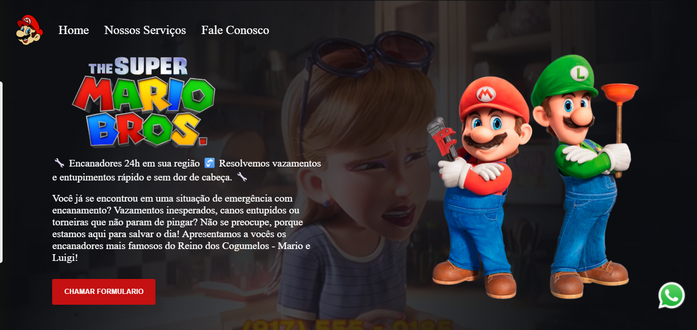

# 🔧 Mario Bros Encanador 24h

Landing page inspirada no universo do Mario Bros, desenvolvida para divulgar serviços de encanador 24h com design moderno e responsivo.

---

## 🚀 Demonstração

🔗 Em breve ()

---

## 🎯 Objetivo

Este projeto foi desenvolvido com o objetivo de:

* Praticar HTML, CSS e JavaScript
* Criar uma landing page profissional
* Simular um site real de prestação de serviços
* Melhorar habilidades de desenvolvimento front-end

---

## 🛠️ Tecnologias utilizadas

* HTML5
* CSS3
* JavaScript

---

## 📱 Funcionalidades

* Layout responsivo (mobile e desktop)
* Design inspirado no Mario Bros 🎮
* Seção de serviços
* Destaque para atendimento 24h
* Botão de contato (WhatsApp)
* Formulário funcional com JavaScript

---

## 📂 Estrutura do projeto

```
mario-bros-landing-page/
│── index.html
│── style.css
│── scripts.js
│── img/
```

---

## 📸 Preview



---

## 💡 Aprendizados

Durante o desenvolvimento, foram praticados:

* Estruturação semântica com HTML
* Estilização com CSS
* Organização de layout
* Criação de interfaces com foco em conversão

---

## 🚧 Melhorias futuras

* Melhorar o design e a experiência do usuário (UX)
* Otimizar performance da página
* Adicionar novas seções (ex: depoimentos de clientes)
* Deploy com domínio próprio

---

## 👨‍💻 Autor

Desenvolvido por **Raydev**

---

## ⭐ Contribuição

Sinta-se à vontade para contribuir com melhorias ou sugestões!

---

## 📄 Licença

Este projeto está sob a licença MIT.
